# KTC Online Portal — Role & Operation Flows

Detailed flowcharts of **every path each role can take**, the two operational spines
(Job Order + Release / Pull-out), and where the roles plug in. Diagrams are **Mermaid**
(render in GitHub, Obsidian, and most Markdown viewers).

**Source of truth:** synthesized from the live code + the **live `role_permissions`
table** and the SECURITY DEFINER RPC guards. Migrations through **0183** (the ADR-0035
job-order ops overhaul + the whole-app audit closure; verified 2026-06-27).

## How to read these

- **Rounded box** = screen/state. **Diamond** = decision/gate. **`[*]`** = start/terminal.
- Edge labels name the **action** and, in `[brackets]`, the **role/permission** that may take it.
- "Customer" = the accredited customs broker (non-staff). Staff roles: **owner, admin,
  operations, cashier, checker, csr**. **Owner bypasses every gate** (failsafe) and so is
  omitted from most edge labels — assume owner can do anything a gate allows.
- All writes go through **SECURITY DEFINER RPCs** gated by `has_permission()` (staff) or the
  `broker_*` helpers (customer); the UI only mirrors these — the server is the real gate.

---

## Roles, landings & permission matrix (verified against the live DB)

| Role | Lands on | Essence |
|---|---|---|
| **owner** | `/admin` | Failsafe — bypasses all gates; can edit the matrix itself |
| **admin** | `/admin` | Full back office; everything **except `confirm_xray`**; **approves** priority + re-X-ray; bills charges |
| **operations** | `/app/operations` | Accept orders + RPS + service completion + vessels; **monitors** X-ray (no confirm); **requests** priority / re-X-ray / charges; **no money, no file-on-behalf** |
| **cashier** | `/app/cashier` | **Money lane only** — payments + ERP invoice + **bills charges**; **no** accept/hold-reject/complete (dropped `0171`); **cannot** see the X-ray queue |
| **checker** | `/app/checker` | Confirms each van's X-ray entry (the spotter); **requests** re-X-ray |
| **csr** | `/app/support` | Support inbox + file-on-behalf + release doc verification + consignee request review + **requests** priority; **never** changes order status |
| **purchaser** | (appmap pending) | Fuel module: procurement + monitoring; **scoped, non-admin** |
| **customer** | `/` | Files/pays own Job Orders & Releases; sees only own data |

> **Landing change (current):** operational roles now land on their **focused staff-PWA screen** (`/app/*`),
> not the `/admin/*` page — the full back office is one tap away via "Open full portal". Only **owner/admin**
> land on `/admin`. (`RoleLanding`, `src/App.tsx`.)

Permission matrix (`✓` allowed · blank = denied · owner = `✓` on all):

| Permission | admin | operations | cashier | checker | csr | purchaser |
|---|:--:|:--:|:--:|:--:|:--:|:--:|
| view_job_orders | ✓ | ✓ | ✓ | ✓ | ✓ |  |
| view_xray_queue | ✓ | ✓ |  | ✓ | ✓ |  |
| view_fuel_reports | ✓ |  |  |  |  | ✓ |
| file_job_orders | ✓ |  |  |  | ✓ |  |
| accept_orders | ✓ | ✓ |  |  |  |  |
| process_job_orders | ✓ | ✓ |  |  |  |  |
| complete_orders | ✓ | ✓ |  |  |  |  |
| hold_reject_orders | ✓ | ✓ |  |  |  |  |
| confirm_xray |  |  |  | ✓ |  |  |
| request_priority | ✓ | ✓ |  |  | ✓ |  |
| approve_priority | ✓ |  |  |  |  |  |
| request_rexray | ✓ | ✓ |  | ✓ |  |  |
| approve_rexray | ✓ |  |  |  |  |  |
| request_supplement | ✓ | ✓ |  |  |  |  |
| bill_supplement | ✓ |  | ✓ |  |  |  |
| assess_rps | ✓ | ✓ |  |  |  |  |
| review_payments | ✓ |  | ✓ |  |  |  |
| record_invoice | ✓ |  | ✓ |  |  |  |
| log_fuel | ✓ |  |  |  |  | ✓ |
| manage_fuel | ✓ |  |  |  |  | ✓ |
| verify_release_docs | ✓ |  |  |  | ✓ |  |
| review_consignee_requests | ✓ |  |  |  | ✓ |  |
| manage_vessel_schedule | ✓ | ✓ |  |  |  |  |
| manage_support | ✓ |  |  |  | ✓ |  |
| manage_approvals | ✓ |  |  |  |  |  |
| manage_customers | ✓ |  |  |  |  |  |
| manage_consignees | ✓ |  |  |  |  |  |
| manage_pricing | ✓ |  |  |  |  |  |

**ADR-0035 maker-checker gates** (`0171`–`0177`): the six request/approve rows —
`request_priority`/`approve_priority`, `request_rexray`/`approve_rexray`,
`request_supplement`/`bill_supplement` — split *propose* from *approve/bill* so a requester can
never self-approve. **`0171` separation of duties:** CSR lost `accept_orders` / `hold_reject_orders`
(intake + comms only); cashier lost `hold_reject_orders` / `complete_orders` (money lane only).
**Completion is now automatic** — no role clicks "complete"; the order self-completes when the last
gate (services *or* payment) lands. **Confirming a base payment requires the ERP invoice + BIR pad
serial on file** (`record_service_invoice`, `0177`/`0178`).

---

## 1. Whole-operation overview

How a shipment moves through the portal, and which role drives each leg. Two independent
spines share one customer account and one back office.

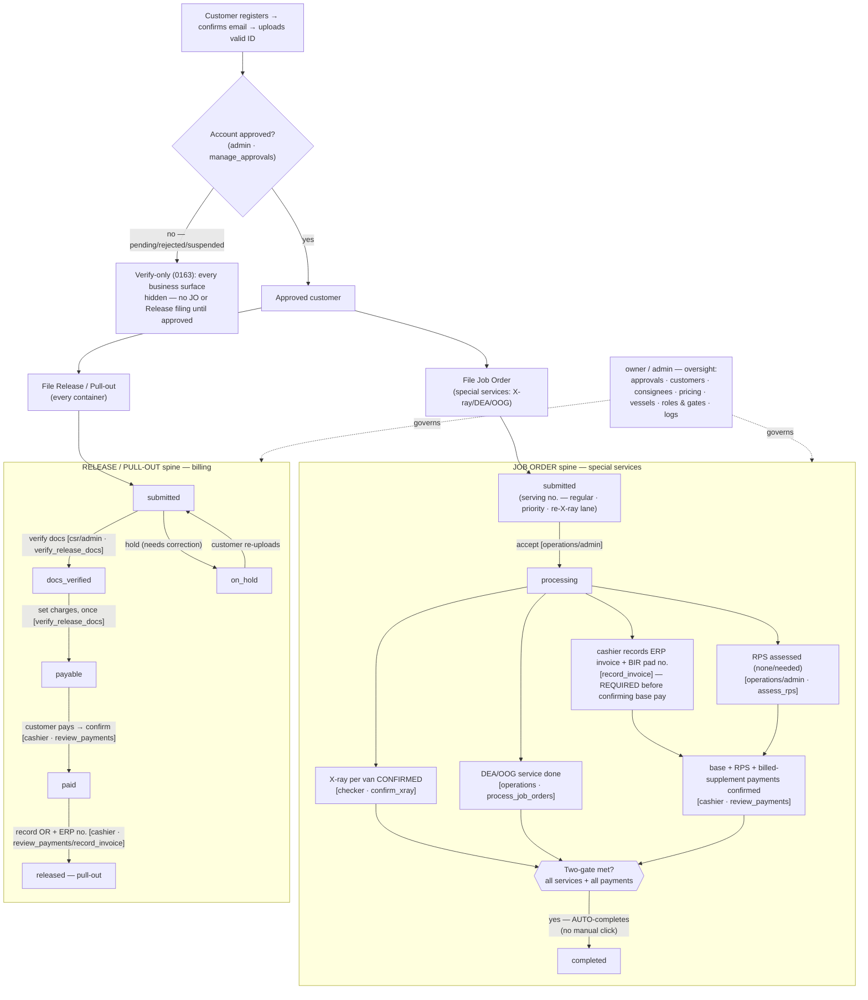

---

## 2. Job Order spine — state machine

States: `held · submitted · processing · on_hold · completed · rejected · cancelled`.

```mermaid
stateDiagram-v2
    [*] --> submitted: approved customer / CSR-on-behalf files (jo_number + serving no. assigned)
    submitted --> processing: accept_orders [operations/admin]
    submitted --> on_hold: hold_reject_orders [ops/admin]
    submitted --> rejected: hold_reject_orders [ops/admin]
    submitted --> cancelled: cancel_job_order [customer]
    processing --> on_hold: hold_reject_orders [ops/admin]
    processing --> rejected: hold_reject_orders [ops/admin]
    on_hold --> submitted: resubmit_needs_info [customer, field-targeted]
    on_hold --> cancelled: cancel_job_order [customer]
    processing --> completed: TWO-GATE met — AUTO (services + payments)
    rejected --> [*]: terminal (no resubmit; use the on_hold path)
    cancelled --> [*]
    completed --> [*]
    note right of submitted
      held is legacy — pending customers are now
      verify-only (0163) and can no longer file
    end note
    note right of completed
      a charge billed after completion does NOT
      revert it (0183) — stays completed, flagged
      has_open_supplement until the charge is paid
    end note
```

**TWO-GATE completion** (`jo_ready_to_complete` + the `complete_on_payment_confirmed` /
`complete_on_service_done` triggers + `enforce_two_gate_complete` backstop) — `processing → completed`
fires **automatically** (no role clicks "complete") when **all** hold:

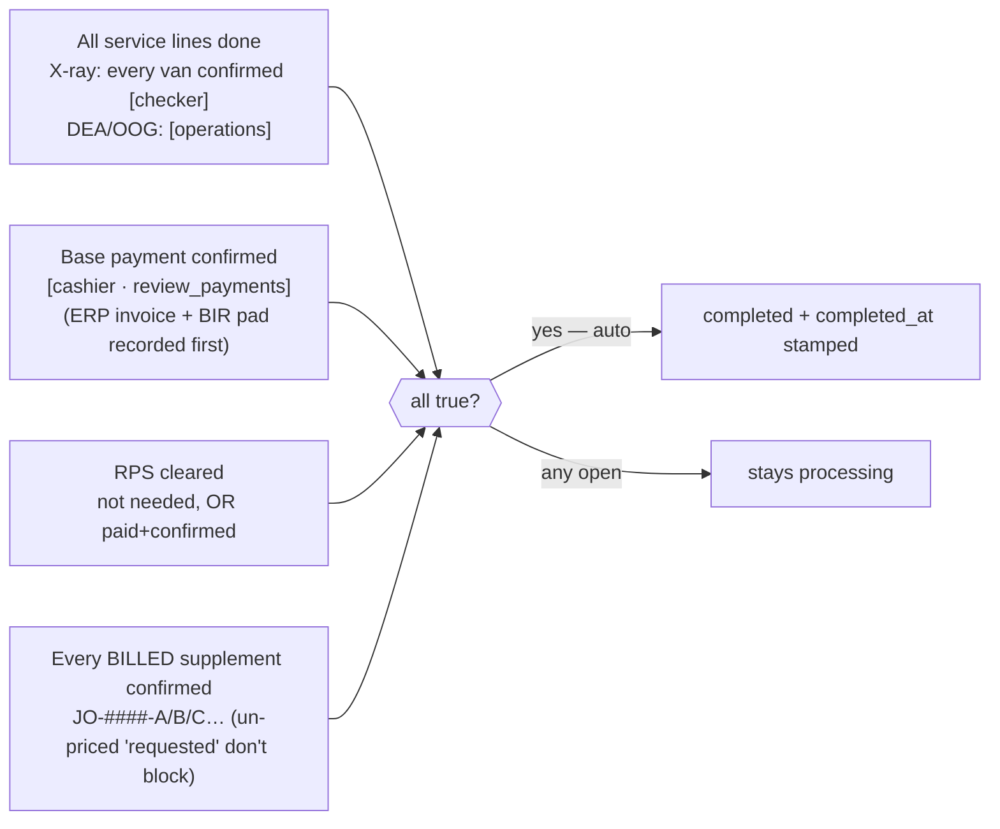

### 2a. Serving lanes + escalations — priority & re-X-ray (ADR-0035)

The serving number is assigned/vacated **automatically** on status (`serving_numbers_on_status`, `0173`):
it lands on `submitted`/`processing` and vacates (→ off the board) on `on_hold`/`rejected`/`cancelled`/`completed`.
Returning to the line gets a **new tail number** (the manual `restore_serving_number` queue-jump was dropped,
`0182`). Three lanes run in parallel — **regular**, a **priority** lane served first, and a **re-X-ray** child
lane — each numbered independently; the checker/operations queue sorts **priority → regular → re-X-ray**.

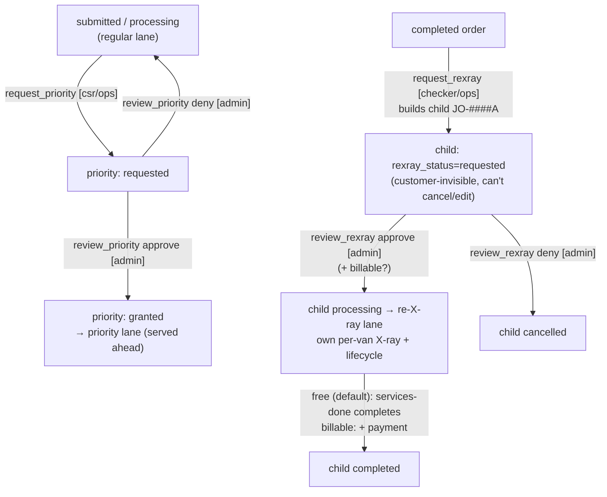

> A re-X-ray child can't be X-rayed before admin approval (`record_van_xray` guard, `0181`), can't be
> accepted via the generic `accept_orders` path (`0178`), and emits **no** customer notifications (it's
> internal); `request_rexray`/`request_supplement` instead **ping staff** by gate (`notify_staff`, `0183`).

---

## 3. Release / Pull-out spine — state machine

States: `submitted · docs_verified · payable · paid · released · on_hold · cancelled`.
Customer must be **approved** to file (no held/pending path, unlike JOs).

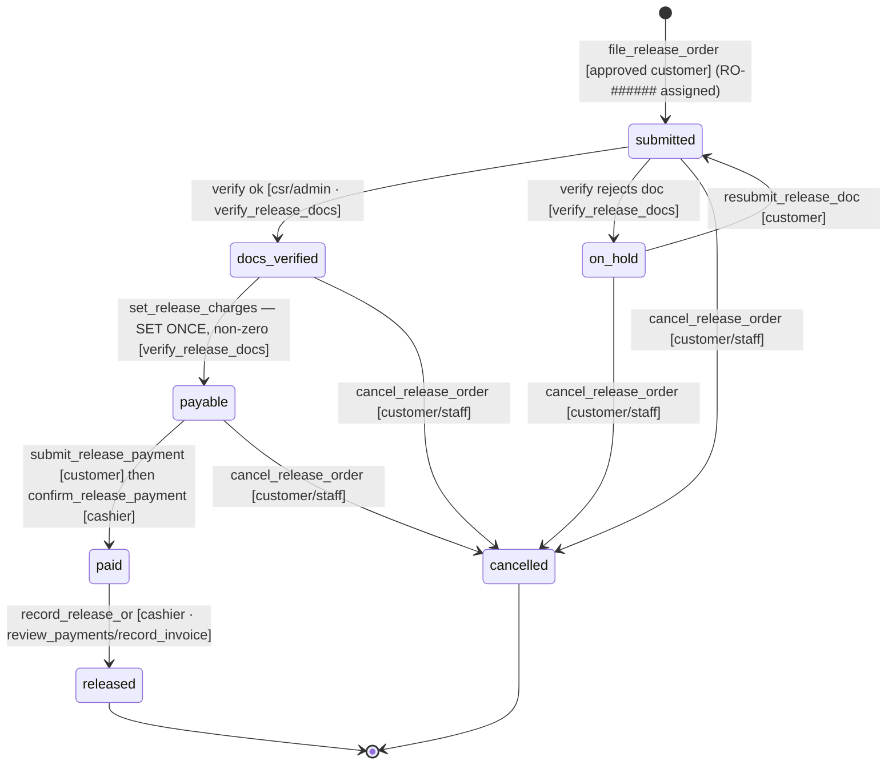

**Additional charges & the OR block** — base charge is set **once**; anything missed is a
**supplement** the customer pays separately, and the **OR is blocked until every supplement
is confirmed**:

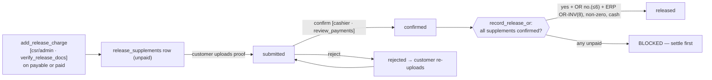

---

## 4. Per-role flows

### 4.1 Customer (customs broker)

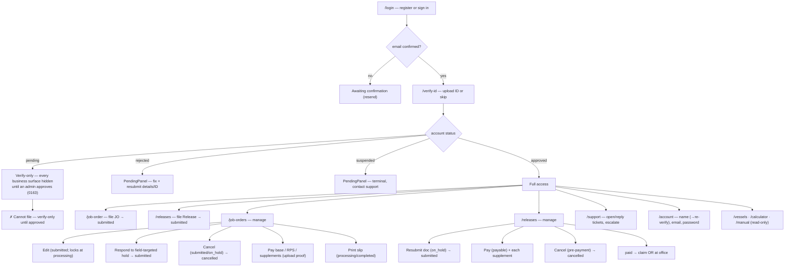

**Customer is blocked from:** filing anything while **pending** (verify-only, `0163`); editing an order
once `processing`; cancelling once `processing` (JO) or once `paid` (release); resubmitting a `rejected`
order (terminal — use the field-targeted `on_hold` path); touching an internal **re-X-ray** child;
requesting or pricing charges; confirming any payment; filing a Release while not `approved`.

### 4.2 Owner

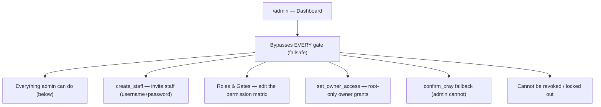

### 4.3 Admin

```mermaid
flowchart TD
    AD["/admin — Dashboard"] --> AP["Approvals — approve/reject customers & consignees<br/>[manage_approvals] → unblocks the verify-only customer (filing + releases)"]
    AD --> CU["Customers — suspend/edit [manage_customers]"]
    AD --> CO["Consignees — manage master list [manage_consignees]"]
    AD --> PR["Settings — rates/fees/pricing [manage_pricing]"]
    AD --> VE["Vessel schedule [manage_vessel_schedule]"]
    AD --> JOA["Job Orders — accept/hold/reject [accept/hold_reject_orders] · complete is AUTO"]
    AD --> APRX["Approve priority + re-X-ray requests<br/>[approve_priority / approve_rexray]"]
    AD --> RPSa["Assess RPS [assess_rps]"]
    AD --> PAYa["Confirm payments + record ERP invoice (req. before base confirm) + bill charges<br/>[review_payments / record_invoice / bill_supplement]"]
    AD --> RELa["Release docs desk: verify + set charges [verify_release_docs]"]
    AD --> SUPa["Support inbox [manage_support]"]
    AD --> LOGS["Logs / audit [manage_approvals]"]
    AD --> NOX["✗ Cannot confirm X-ray (checker-only)"]
```

### 4.4 Operations

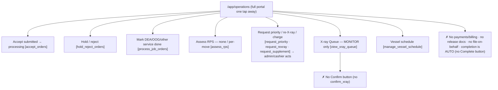

### 4.5 Cashier

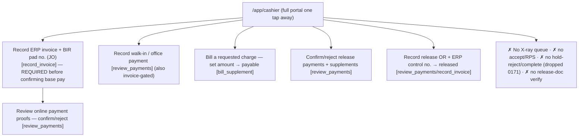

### 4.6 Checker (X-ray spotter)

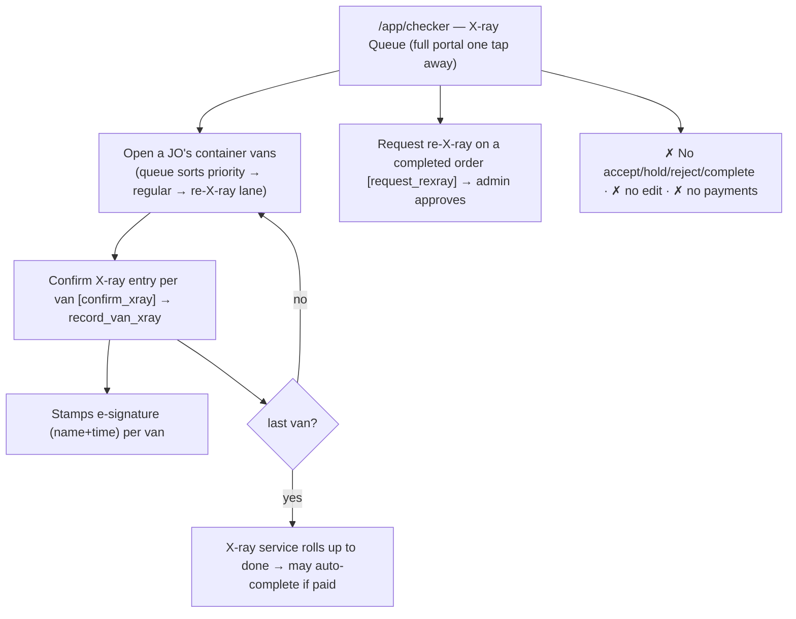

### 4.7 CSR (customer service)

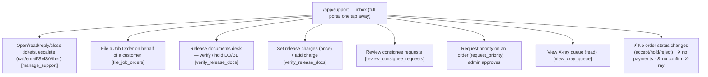

---

## Cross-role hand-off summary

| Hand-off | From → To | Gate |
|---|---|---|
| Account approval unblocks filing | admin → customer | `manage_approvals` |
| JO accepted into processing | operations/admin | `accept_orders` |
| X-ray confirmed per van | checker | `confirm_xray` |
| DEA/OOG done · RPS assessed | operations/admin | `process_job_orders` · `assess_rps` |
| Payments confirmed (JO + release) | cashier/admin | `review_payments` |
| ERP invoice recorded (**required before base-pay confirm**) / release OR recorded | cashier/admin | `record_invoice` / `review_payments` |
| Priority granted | csr/ops request → admin approve | `request_priority` → `approve_priority` |
| Re-X-ray approved | checker/ops request → admin approve | `request_rexray` → `approve_rexray` |
| Charge billed (ops never bills directly) | ops request → cashier bill | `request_supplement` → `bill_supplement` |
| Release documents verified | csr/admin | `verify_release_docs` |
| Release charges set / supplements | csr/admin | `verify_release_docs` |
| Support handled | csr/admin | `manage_support` |

> Verified 2026-06-27 against the live `role_permissions` table + the RPC guards in
> `supabase/migrations/**` through 0183 (ADR-0035 ops overhaul + audit closure). If a gate is re-toggled
> in **Settings → Roles & Gates**, this matrix and these flows change with it — the server enforces the
> live matrix, not this doc.
