# KTC Online Portal — Role & Operation Flows

Detailed flowcharts of **every path each role can take**, the two operational spines
(Job Order + Release / Pull-out), and where the roles plug in. Diagrams are **Mermaid**
(render in GitHub, Obsidian, and most Markdown viewers).

**Source of truth:** synthesized from the live code + the **live `role_permissions`
table** (queried 2026-06-25) and the SECURITY DEFINER RPC guards. Migrations through **0158**.

## How to read these

- **Rounded box** = screen/state. **Diamond** = decision/gate. **`[*]`** = start/terminal.
- Edge labels name the **action** and, in `[brackets]`, the **role/permission** that may take it.
- "Customer" = the accredited customs broker (non-staff). Staff roles: **owner, admin,
  operations, cashier, checker, csr**. **Owner bypasses every gate** (failsafe) and so is
  omitted from most edge labels — assume owner can do anything a gate allows.
- All writes go through **SECURITY DEFINER RPCs** gated by `has_permission()` (staff) or the
  `broker_*` helpers (customer); the UI only mirrors these — the server is the real gate.

---

## Roles, landings & permission matrix (verified against the live DB)

| Role | Lands on | Essence |
|---|---|---|
| **owner** | `/admin` | Failsafe — bypasses all gates; can edit the matrix itself |
| **admin** | `/admin` | Full back office; everything **except `confirm_xray`** |
| **operations** | `/admin/job-orders` | Intake/accept + RPS + service completion + vessels; **monitors** X-ray (no confirm); no money |
| **cashier** | `/admin/cashier` | Payments + ERP invoice/OR; can complete/hold-reject; **cannot** see the X-ray queue |
| **checker** | `/admin/checker` | **Only** confirms each van's X-ray entry (the spotter) |
| **csr** | `/admin/support` | Support inbox + file-on-behalf + **release document verification** + **consignee request review** |
| **purchaser** | (appmap pending) | Fuel module: procurement + monitoring; **scoped, non-admin** |
| **customer** | `/` | Files/pays own Job Orders & Releases; sees only own data |

Permission matrix (`✓` allowed · blank = denied · owner = `✓` on all):

| Permission | admin | operations | cashier | checker | csr | purchaser |
|---|:--:|:--:|:--:|:--:|:--:|:--:|
| view_job_orders | ✓ | ✓ | ✓ | ✓ | ✓ |  |
| view_xray_queue | ✓ | ✓ |  | ✓ | ✓ |  |
| view_fuel_reports | ✓ |  |  |  |  | ✓ |
| file_job_orders | ✓ |  |  |  | ✓ |  |
| accept_orders | ✓ | ✓ |  |  |  |  |
| process_job_orders | ✓ | ✓ |  |  |  |  |
| complete_orders | ✓ | ✓ | ✓ |  |  |  |
| hold_reject_orders | ✓ | ✓ | ✓ |  |  |  |
| confirm_xray |  |  |  | ✓ |  |  |
| assess_rps | ✓ | ✓ |  |  |  |  |
| review_payments | ✓ |  | ✓ |  |  |  |
| record_invoice | ✓ |  | ✓ |  |  |  |
| log_fuel | ✓ |  |  |  |  | ✓ |
| manage_fuel | ✓ |  |  |  |  | ✓ |
| verify_release_docs | ✓ |  |  |  | ✓ |  |
| review_consignee_requests | ✓ |  |  |  | ✓ |  |
| manage_vessel_schedule | ✓ | ✓ |  |  |  |  |
| manage_support | ✓ |  |  |  | ✓ |  |
| manage_approvals | ✓ |  |  |  |  |  |
| manage_customers | ✓ |  |  |  |  |  |
| manage_consignees | ✓ |  |  |  |  |  |
| manage_pricing | ✓ |  |  |  |  |  |

---

## 1. Whole-operation overview

How a shipment moves through the portal, and which role drives each leg. Two independent
spines share one customer account and one back office.

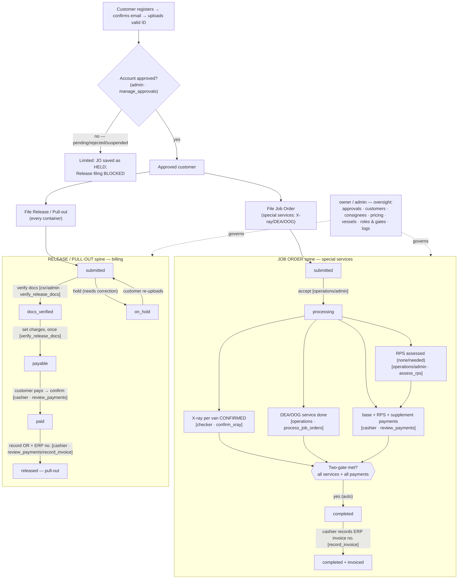

---

## 2. Job Order spine — state machine

States: `held · submitted · processing · on_hold · completed · rejected · cancelled`.

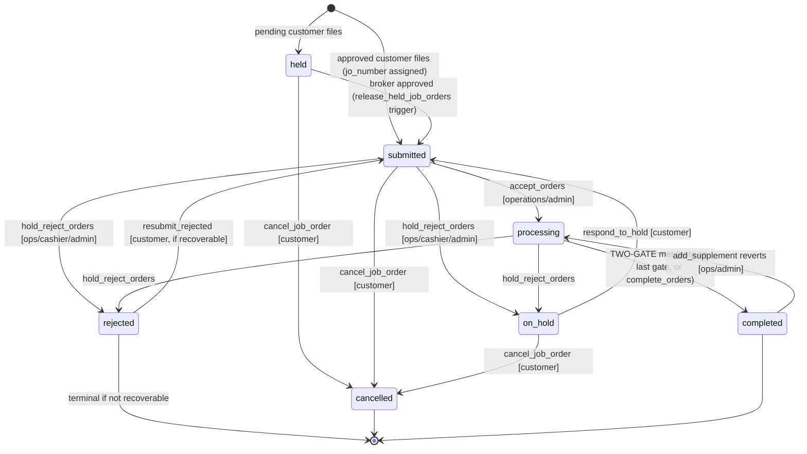

**TWO-GATE completion** (`jo_ready_to_complete` + `complete_on_payment_confirmed` trigger +
`enforce_two_gate_complete` backstop) — `processing → completed` only when **all** hold:

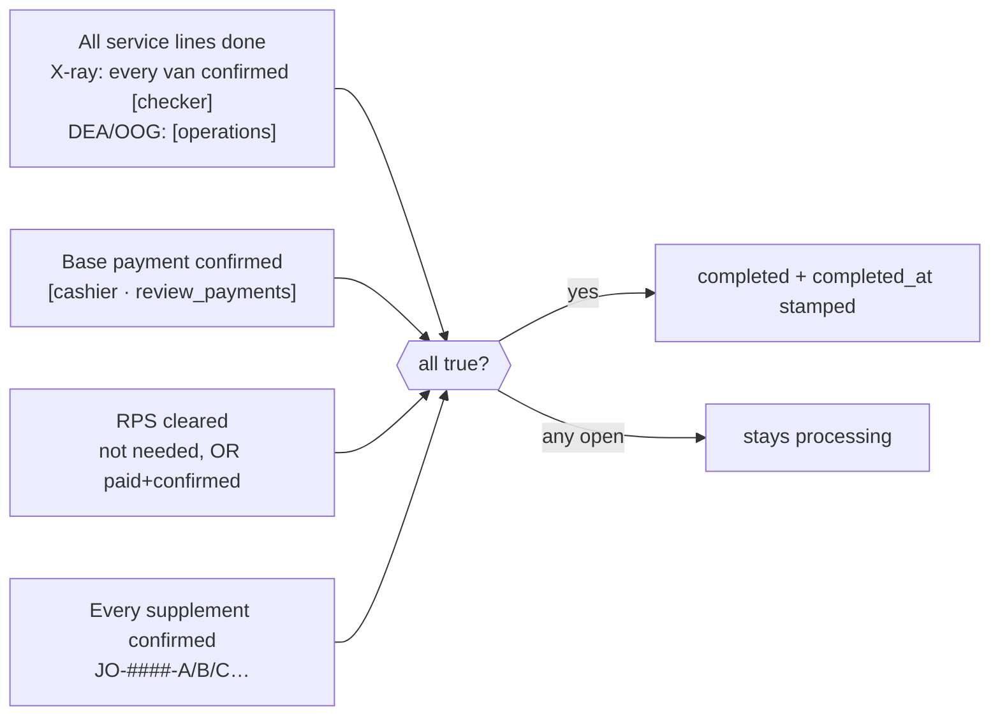

---

## 3. Release / Pull-out spine — state machine

States: `submitted · docs_verified · payable · paid · released · on_hold · cancelled`.
Customer must be **approved** to file (no held/pending path, unlike JOs).

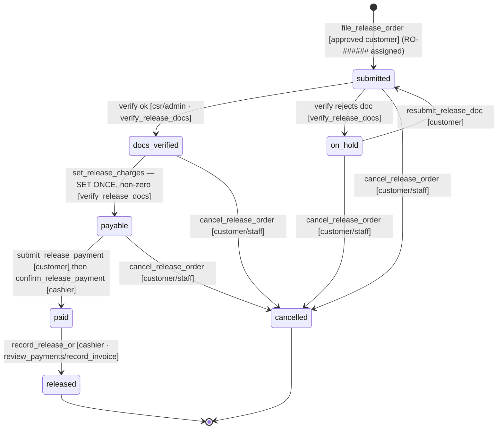

**Additional charges & the OR block** — base charge is set **once**; anything missed is a
**supplement** the customer pays separately, and the **OR is blocked until every supplement
is confirmed**:

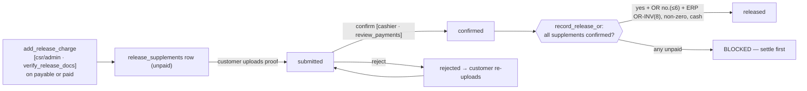

---

## 4. Per-role flows

### 4.1 Customer (customs broker)

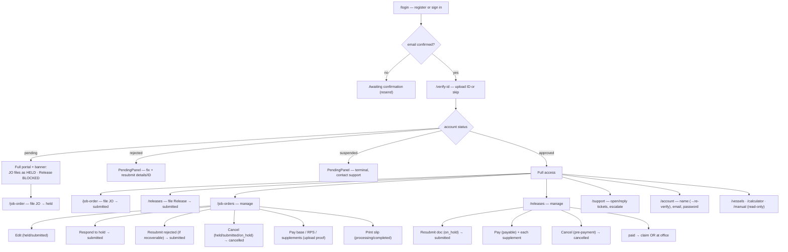

**Customer is blocked from:** editing an order once `processing`; cancelling once
`processing` (JO) or once `paid` (release); adding supplements; confirming any payment;
filing a Release while not `approved`.

### 4.2 Owner

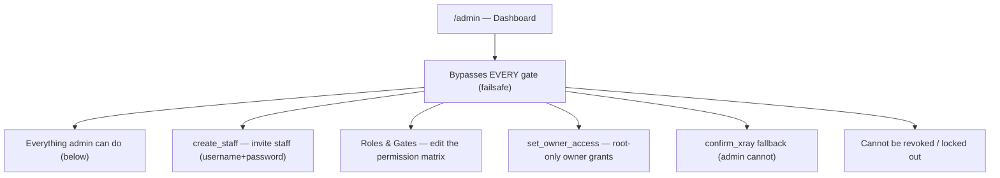

### 4.3 Admin

```mermaid
flowchart TD
    AD["/admin — Dashboard"] --> AP["Approvals — approve/reject customers & consignees<br/>[manage_approvals] → unblocks held JOs & release filing"]
    AD --> CU["Customers — suspend/edit [manage_customers]"]
    AD --> CO["Consignees — manage master list [manage_consignees]"]
    AD --> PR["Settings — rates/fees/pricing [manage_pricing]"]
    AD --> VE["Vessel schedule [manage_vessel_schedule]"]
    AD --> JOA["Job Orders — accept/hold/reject/complete [accept/hold_reject/complete_orders]"]
    AD --> RPSa["Assess RPS [assess_rps]"]
    AD --> PAYa["Confirm payments + record ERP invoice/OR [review_payments/record_invoice]"]
    AD --> RELa["Release docs desk: verify + set charges [verify_release_docs]"]
    AD --> SUPa["Support inbox [manage_support]"]
    AD --> LOGS["Logs / audit [manage_approvals]"]
    AD --> NOX["✗ Cannot confirm X-ray (checker-only)"]
```

### 4.4 Operations

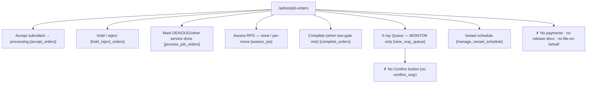

### 4.5 Cashier

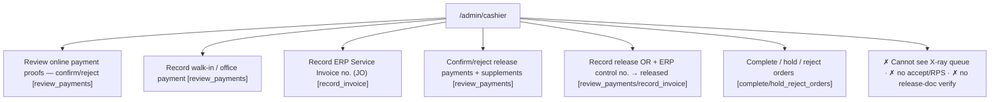

### 4.6 Checker (X-ray spotter)

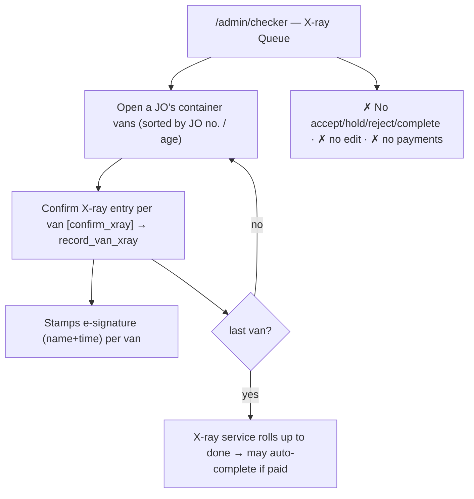

### 4.7 CSR (customer service)

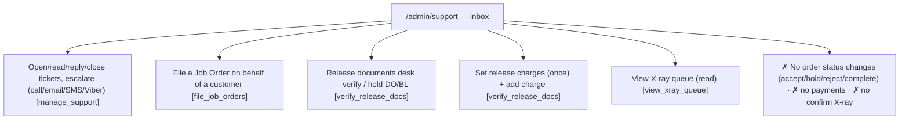

---

## Cross-role hand-off summary

| Hand-off | From → To | Gate |
|---|---|---|
| Account approval unblocks filing | admin → customer | `manage_approvals` |
| JO accepted into processing | operations/admin | `accept_orders` |
| X-ray confirmed per van | checker | `confirm_xray` |
| DEA/OOG done · RPS assessed | operations/admin | `process_job_orders` · `assess_rps` |
| Payments confirmed (JO + release) | cashier/admin | `review_payments` |
| ERP invoice / OR recorded | cashier/admin | `record_invoice` / `review_payments` |
| Release documents verified | csr/admin | `verify_release_docs` |
| Release charges set / supplements | csr/admin | `verify_release_docs` |
| Support handled | csr/admin | `manage_support` |

> Verified 2026-06-25 against the live `role_permissions` table + the RPC guards in
> `supabase/migrations/**` through 0158. If a gate is re-toggled in **Settings → Roles & Gates**, this
> matrix and these flows change with it — the server enforces the live matrix, not this doc.
