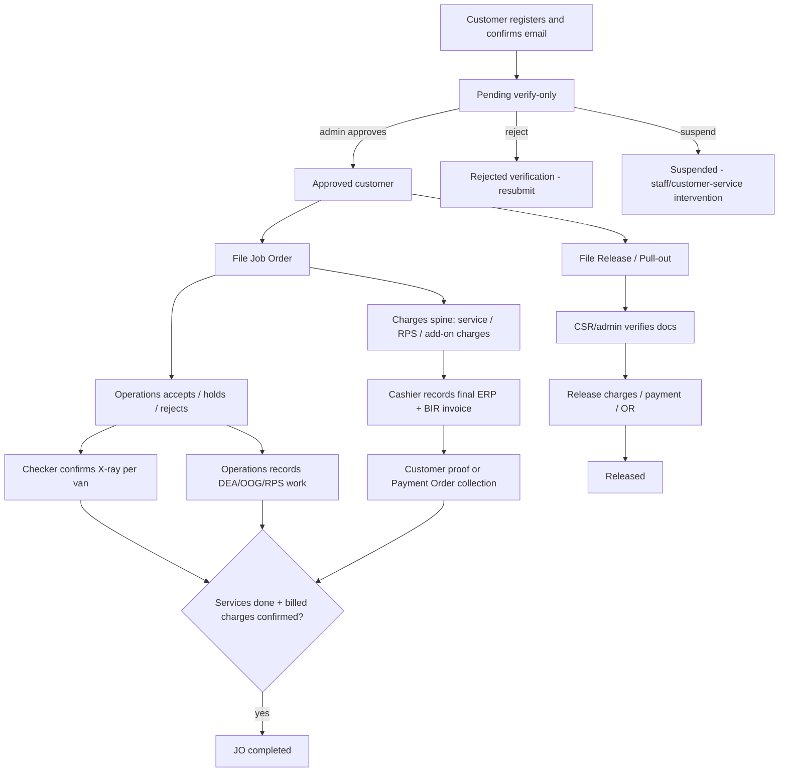
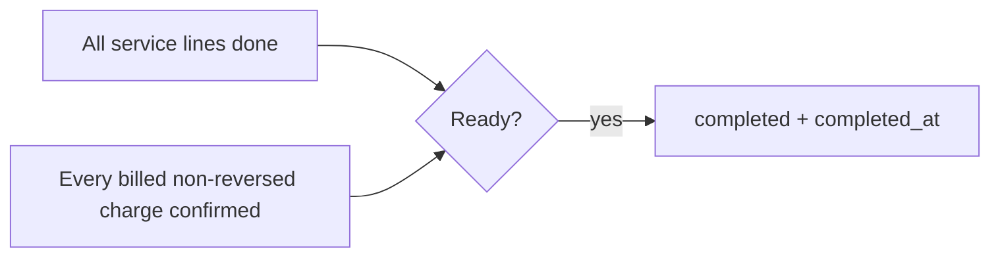
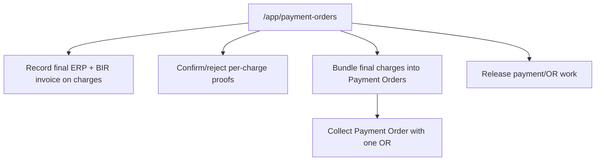

# Role and Operation Flows

Production is the contract source for these flows. Sandbox mirrors the same migrations/schema/functions for smoke testing, with separate env vars, secrets, and seed data.

## Roles and Landings

| Role | Landing | Core responsibility |
|---|---|---|
| owner | `/admin` | Failsafe, all gates, root-owner controls |
| admin | `/admin` | Full back office except `confirm_xray` |
| operations | `/app/operations` | Accept/hold/reject, service work, RPS, priority/re-X-ray requests, operational charge work |
| cashier | `/app/payment-orders` | Charge invoices, proof review, Payment Order bundling/collection, release payment/OR work |
| checker | `/app/checker` | Per-van X-ray confirmation |
| csr | `/app/support` | Support, file-on-behalf, consignee requests, priority requests, release document checks |
| purchaser | no live route | Parked fuel role |
| customer | `/` | Own JOs, releases, charges, support, account |

Retired routes: `/admin/cashier`, `/app/cashier`, and `/job-order/:id/pay`.

## Whole Operation

## Two-Gate Completion

Free re-X-ray children complete on services-done alone. Billable re-X-ray children must clear the charge gate.

## Permission Summary

| Action | Role/gate |
|---|---|
| Account approval | `manage_approvals` |
| JO accept | `accept_orders` |
| JO hold/reject | `hold_reject_orders` |
| Service done / operational work | `process_job_orders` |
| X-ray confirmation | `confirm_xray` |
| RPS assessment | `assess_rps` |
| Add/approve charges | charge RPC gates from ADR-0037 |
| Final charge invoice | `record_invoice` |
| Charge payment / Payment Order collection | `review_payments` |
| Release document verification | `verify_release_docs` |
| Support | `manage_support` |

## Cashier Flow

## Source of Truth

- Runtime routes: `src/App.tsx`.
- Charge UI: `src/components/JobOrderCharges.tsx`, `src/admin/ChargeApproval.tsx`, `src/admin/PaymentOrderDesk.tsx`.
- Cutover proof: `docs/smoke-test-06-portal.md (closed legacy ADR-0037 proof)`.
- Go-live execution: `docs/smoke-test-08-go-live.md`.