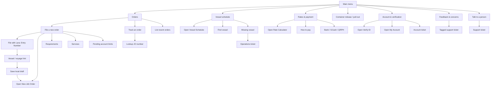

# Lara Chatbot Map

Current source of truth: `src/components/chat/nodes.ts`.

This map is for review/editing of the authored paths only. Lara remains deterministic: no LLM, no hidden generation, and support-ticket writes still go through `open_ticket`.

## Filing Guardrail

Lara does not submit job orders directly. The safe handoff is:

1. Capture entry number and vessel/voyage hint.
2. Save a local draft in `sessionStorage`.
3. Open `/job-order?laraDraft=1`.
4. The real form handles consignee selection, vessel matching, supporting image upload, containers, review, and final submit.
