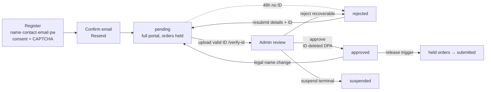
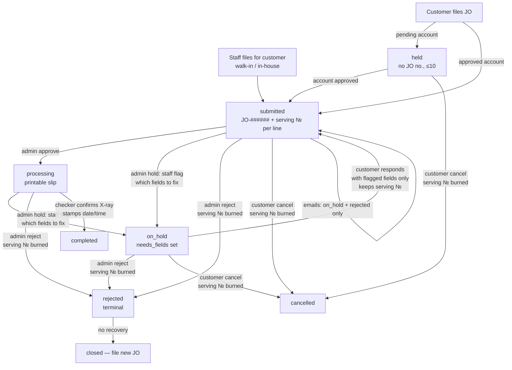

# 🗺️ Process Flow Map & Gap Analysis (2026-06-25)

End-to-end flow as **built today**, then the gaps. Diagrams are Mermaid —
they render on GitHub and in Obsidian.

## A. Account lifecycle



## B. Job-order lifecycle (with serving numbers)



## C. Physical / money flow (X-ray-first, cashier = final gate)

```mermaid
flowchart LR
  SLIP[Printed JO slip<br/>JO no. + serving №] --> LINE[X-ray line<br/>now-serving board]
  LINE --> CHK[Checker tablet<br/>confirm done → completed]
  CHK --> PAY{Payment}
  PAY -->|online| PROOF[Pay page: charges + bank/QR<br/>upload slip → staff confirm/reject]
  PAY -->|window| CASH[Cashier]
  PROOF --> CASH
  CASH -->|ERP Service Invoice<br/>JO no. on invoice| SI[record SI no. in portal = PAID]
  SI --> REL[Ops releases container<br/>no invoice = no movement]
  CHK -. clearance lookup by van no. .- GATE[Gate / spotter]
  SI -. EOD audit: completed w/o SI = unpaid .- AUDIT[Back office]
  PORTAL[(Portal DB)] -->|hourly one-way mirror| BOC[BOC Google Sheet]
```

## D. Gap analysis

| # | Gap | Severity | Notes / suggested fix |
|---|-----|----------|----------------------|
| G1 | ~~Per-service completion~~ | ✅ **Fixed** (`0040`) | `service_completions` per line; `record_service_done` RPC (checker = X-ray, admin = any); JO completes only when ALL its lines are done (else submitted→processing); admin force-complete syncs the rows; checker queue drops orders once their X-ray is done; per-line ✓/pending chips + per-line done buttons on the admin queue. |
| G2 | ~~Carry-over at the weekly reset~~ | ✅ **Fixed** (`0040`) | Policy: carry-overs **keep priority** — Monday 00:15 PH cron (`requeue_carryovers`, also runnable manually) re-queues still-open orders at the FRONT of the new week's line in their old order; old numbers burned. |
| G3 | ~~Admin "file on behalf of"~~ | ✅ **Fixed** (`0041`) | `/admin/new-job-order` ("New JO" tab): customer picker + the same consignee/containers form, filed via `admin_file_job_order` RPC straight to `submitted` (JO no. + serving numbers + audit actor from the same triggers as a customer filing). New owner gate `file_job_orders` (admin ON); staff filings bypass the order caps (admin filing IS the "contact admin" escape hatch). Success panel → print slip / file another. |
| G4 | ~~Completed-but-unpaid report~~ | ✅ **Fixed** (`0039`) | "Unpaid · completed" queue view with `unpaid Nd` aging chips (red 3+ days) off the new `completed_at` stamp. |
| G5 | ~~Admin queue scale~~ | ✅ **Fixed** | Segmented server-side views (Open default / Unpaid / Completed / Rejected·cancelled / Archived / All) + 50-row pagination. Plus a **weekly archive**: completed+paid orders auto-archive Mondays (pg_cron) or via the 🗄 button; archived orders leave the default views, customer history untouched. |
| G6 | ~~No actor audit on JO transitions~~ | ✅ **Fixed** (`0040`) | Append-only `job_order_events` (filed, status changes w/ note, per-service completions, payment events, invoice recorded, archived; `actor` = user, null = system). Written only by triggers/definer functions; staff-readable; **🕘 History** expander on every queue card with actor names + timestamps. |
| G7 | ~~Staff password reset~~ | ✅ **Fixed** (`0039`) | Owner-only `reset_staff_password` RPC + inline reset on the Settings staff list. |
| G8 | ~~Payment-review notifications~~ | ✅ **Fixed** (`0042`) | Payment-proof **rejected** → email (action-required, joins the lean set; links straight to the order's pay page). Confirmations stay in-app. Template/vault/http_post extracted into a shared `send_portal_email` helper. |
| G9 | ~~SI number free-text~~ | ✅ **Fixed** (`0043`) | Real formats confirmed from the ERP (2026-06-12): **OR #** = 5-digit cash OR pad (BIR series 50001–125000) · **Billing Invoice** = 6-digit credit pad · **ERP control no.** = `OR-INV-########` / `BI-INV-########`. `record_service_invoice` requires **BOTH** (`0044`): the ERP control no. (normalized: uppercase, dashes, zero-pad 8 → `service_invoice_no`) **and** the printed pad serial (4–8 digits, leading zeros kept → `invoice_pad_no`); each validated, set atomically, both in the audit detail. **`BI-` = billed on credit, not cash-paid** → queue chip + customer labels say **BILLED** instead of PAID (release gate unchanged: invoice on file = released). |
| G10 | **Full order edit** (containers) post-filing still limited to the hold-response path | Low (by design, deferred) | Revisit with per-line state (G1). |
| G11 | **Go-live gate** — 2 of 3 done | Gate for launch | ✅ **Agreement v2** drafted (DPA-aligned, protective; DPO = Jan Lawrence Ang) — counsel sign-off pending. ✅ **Playwright Phase 2 LIVE** (2026-06-12): dedicated test project `zwvzadkgeyhkhyshkwhc` with all 49 migrations + seeded accounts; **16/16 passing** (mint-race + stale selectors fixed; 4 mutation lanes remain `fixme` to implement later). ⬜ **ST02 manual run** on live (`docs/smoke-test-02-portal.md`) — owner to execute. |
| G12 | ~~Observability~~ | ✅ **Fixed** (`0045`) | All in-Supabase, no third-party SDK: **`app_errors`** (client JS errors via capped `log_client_error` RPC + global handlers + ErrorBoundary), **`outbound_requests`** (every pg_net send logs its request id; results reconciled from `net._http_response`), **`system_health()`** admin RPC behind a **Settings → System health** panel (per-cron last run/status, outbound failures, client errors), and a **15-minute `ops-watchdog`** cron (`0046`) that emails the OWNER on failed cron runs / failed sends / **ANY client error** / **ANY blocked privilege-escalation attempt** (`security_events`, owner-read; the guard trigger now logs what it reverts instead of silently reverting; per-category dedupe 6h, security 1h) and prunes old rows. **Auto-kick (`0047`):** a customer's own escalation attempt = instant suspension + session revocation; staff attempts alert-only (owner decides). |

**Resolved this cycle (for the record):** on-hold/rejected dead ends, customer cancel, status emails (lean set), payment page + review, serving numbers + restore, roles/gates, checker station + van clearance lookup, SI-no = PAID, BOC mirror (awaiting Google creds), order-cap race, upload hardening, auth policy.

## Related
- [[Job Order Lifecycle]] · [[Payment & Cashier Handoff (proposal)]] · [[BOC Sheets Mirror]] · [[Vessel Schedule Monitoring]]
