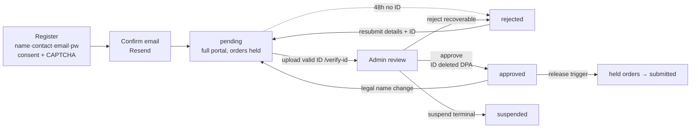
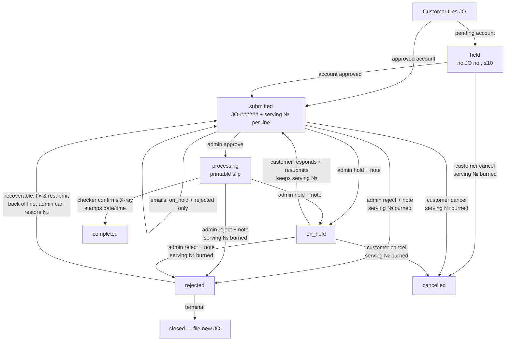

# 🗺️ Process Flow Map & Gap Analysis (2026-06-11)

End-to-end flow as **built today**, then the gaps. Diagrams are Mermaid —
they render on GitHub and in Obsidian.

## A. Account lifecycle



## B. Job-order lifecycle (with serving numbers)



## C. Physical / money flow (X-ray-first, cashier = final gate)

```mermaid
flowchart LR
  SLIP[Printed JO slip<br/>JO no. + serving №] --> LINE[X-ray line<br/>now-serving board]
  LINE --> CHK[Checker tablet<br/>confirm done → completed]
  CHK --> PAY{Payment}
  PAY -->|online| PROOF[Pay page: charges + bank/QR<br/>upload slip → staff confirm/reject]
  PAY -->|window| CASH[Cashier]
  PROOF --> CASH
  CASH -->|ERP Service Invoice<br/>JO no. on invoice| SI[record SI no. in portal = PAID]
  SI --> REL[Ops releases container<br/>no invoice = no movement]
  CHK -. clearance lookup by van no. .- GATE[Gate / spotter]
  SI -. EOD audit: completed w/o SI = unpaid .- AUDIT[Back office]
  PORTAL[(Portal DB)] -->|hourly one-way mirror| BOC[BOC Google Sheet]
```

## D. Gap analysis

| # | Gap | Severity | Notes / suggested fix |
|---|-----|----------|----------------------|
| G1 | **Per-service completion**: one status per JO — the checker confirming X-ray marks the whole order `completed`, even if it also has OOG/DEA lines still pending | **High** (correctness) | Model per-line/per-service state (e.g. `serving_numbers.completed_at` or a line-status column); JO = completed only when all its lines are. Decide before mixed-service orders are common. |
| G2 | **Carry-over at the weekly reset**: an open order from last week keeps last week's serving number — valid, but invisible on this week's board and ambiguous vs new numbers | Medium | Decide policy: auto re-queue leftovers Monday morning (new numbers), or serve carry-overs first. One small cron/RPC either way. |
| G3 | **Admin "file on behalf of"** (walk-ins, in-house ops) — decided, not built | Medium | Reuse the JobOrder form under `/admin` with a customer picker; admin INSERT policy or RPC. Last unbuilt lifecycle item. |
| G4 | ~~Completed-but-unpaid report~~ | ✅ **Fixed** (`0039`) | "Unpaid · completed" queue view with `unpaid Nd` aging chips (red 3+ days) off the new `completed_at` stamp. |
| G5 | ~~Admin queue scale~~ | ✅ **Fixed** | Segmented server-side views (Open default / Unpaid / Completed / Rejected·cancelled / Archived / All) + 50-row pagination. Plus a **weekly archive**: completed+paid orders auto-archive Mondays (pg_cron) or via the 🗄 button; archived orders leave the default views, customer history untouched. |
| G6 | **No actor audit on JO transitions**: we know *when* a status changed, not *who* | Medium | `processed_by uuid` + history table (or append-only log) for accountability across roles. |
| G7 | ~~Staff password reset~~ | ✅ **Fixed** (`0039`) | Owner-only `reset_staff_password` RPC + inline reset on the Settings staff list. |
| G8 | **Payment-review notifications**: confirm/reject is in-app only; a rejected proof can sit unseen | Low-Med | Extend the lean email set with payment-rejected (action-required, matches the policy). |
| G9 | **SI number free-text**: no format/series validation (BIR series 50001–125000), typo risk | Low | Regex/range check in `record_service_invoice` once the real series format is confirmed. |
| G10 | **Full order edit** (containers) post-filing still limited to the hold-response path | Low (by design, deferred) | Revisit with per-line state (G1). |
| G11 | **Go-live legal/testing**: Customer Agreement still template (counsel), ST02 not run on live, Playwright Phase 2 (auth flows) pending | Gate for launch | Counsel → bump `AGREEMENT_VERSION`; run ST02; configure Phase 2 harness. |
| G12 | **Observability**: no error tracking (e.g. Sentry) or uptime alerting on the portal/cron jobs | Low | Add before public launch; cron failures (mirror, expiry) currently fail silent. |

**Resolved this cycle (for the record):** on-hold/rejected dead ends, customer cancel, status emails (lean set), payment page + review, serving numbers + restore, roles/gates, checker station + van clearance lookup, SI-no = PAID, BOC mirror (awaiting Google creds), order-cap race, upload hardening, auth policy.

## Related
- [[Job Order Lifecycle]] · [[Payment & Cashier Handoff (proposal)]] · [[BOC Sheets Mirror]] · [[Vessel Schedule Monitoring]]
